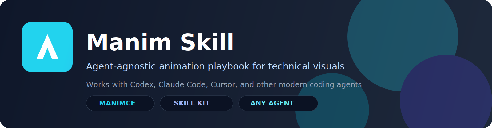

<p align="center">
  
</p>

<p align="center">
  English · <a href="./README.zh-CN.md">简体中文</a>
</p>

<p align="center">
  
  
  
</p>

## What This Repository Is

`manim-skill` is a reusable skill package for creating technical animations with ManimCE.

It is designed for Codex Skills **and** works as an agent-agnostic playbook that can be used by any coding assistant that can read markdown instructions.

## AI-Ready Skill

This repository is designed for AI agents.
Provide `SKILL.md` and relevant files from `references/`, and agents can autonomously:

- choose suitable animation patterns
- generate or modify Manim scenes
- run render commands
- troubleshoot common environment issues (FFmpeg / TeX / fonts)
- iterate outputs to final mp4 or gif

You provide intent; the agent handles execution.

## Agent and IDE Compatibility

<p>
  
  
  
  
  
  
</p>

| Agent / IDE | How to use this skill |
|---|---|
| Codex | Install as a native skill folder (`~/.codex/skills/...`) |
| Claude Code / Cursor / Cline | Use `SKILL.md` + `references/` as project instructions or prompt context |
| Other agents | Use this repository as a structured Manim playbook |

## Highlights

- Clear ManimCE-first workflow (`SKILL.md`)
- Progressive reference docs (`references/`)
- Ready-to-run examples (`examples/`)
- Windows-friendly setup notes
- TeX-free fallback guidance for numeric labels

## Install

### Option 1: Install as a Codex skill

```bash
python ~/.codex/skills/.system/skill-installer/scripts/install-skill-from-github.py \
  --repo awesome-skills/manim-skill \
  --path . \
  --name manim-skill
```

Windows PowerShell:

```powershell
python $HOME\.codex\skills\.system\skill-installer\scripts\install-skill-from-github.py `
  --repo awesome-skills/manim-skill `
  --path . `
  --name manim-skill
```

### Option 2: Use as a standalone playbook

```bash
git clone https://github.com/awesome-skills/manim-skill.git
cd manim-skill
```

Then feed `SKILL.md` and relevant files under `references/` into your agent workflow.

## Quick Start Render

```bash
# Fast preview
uv run --with manim manim -pql examples/quicksort.py QuickSortBars

# GIF export
uv run --with manim manim -qm --format=gif examples/quicksort.py QuickSortBars

# 4K showcase (2160p60)
manim -qk examples/quicksort.py QuickSortBars
```

## Preview

<p align="center">
  <video src="./assets/quicksort-preview.mp4" controls muted loop playsinline width="88%">
    Your browser does not support the video tag.
  </video>
</p>

<p align="center">
  <a href="./assets/quicksort-preview.mp4">Download the preview video</a> ·
  <a href="./assets/quicksort-preview.png">Static fallback image</a>
</p>

## Repository Structure

```text
manim-skill/
├─ SKILL.md
├─ examples/
│  ├─ basic_scene.py
│  ├─ flowchart.py
│  ├─ state_diagram.py
│  └─ quicksort.py
├─ references/
│  ├─ mobjects.md
│  ├─ animations.md
│  ├─ advanced.md
│  └─ blog-patterns.md
└─ assets/
   ├─ banner.svg
   ├─ quicksort-preview.mp4
   └─ quicksort-preview.png
```

## Contributing

Contributions are welcome, especially:

- New algorithm animation templates
- Better cross-platform troubleshooting
- More agent integration examples
