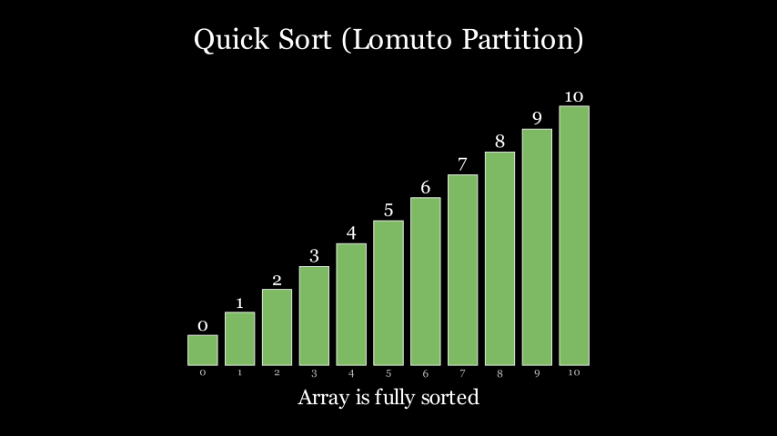

<p align="center">
  
</p>

<p align="center">
  <a href="./README.md">English</a> · 简体中文
</p>

<p align="center">
  
  
  
</p>

## 仓库介绍

`manim-skill` 是一个面向 ManimCE 的可复用技能包，帮助你快速产出技术动画、算法可视化和博客 GIF。

它既可以作为 Codex Skills 原生安装，也可以作为通用知识包给任意 Agent 使用。只要你的 IDE/Agent 能读取 Markdown 指南，就能用这套内容。

## 主流 Agent / IDE 支持

<p>
  
  
  
  
  
  
</p>

| Agent / IDE | 使用方式 |
|---|---|
| Codex | 作为技能目录安装到 `~/.codex/skills/...` |
| Claude Code / Cursor / Cline | 将 `SKILL.md` + `references/` 作为项目规则或上下文 |
| 其他 Agent | 直接把本仓库当作结构化 Manim 指南使用 |

## 核心内容

- ManimCE 优先实践（`SKILL.md`）
- 进阶参考手册（`references/`）
- 可直接运行的案例（`examples/`）
- Windows 友好安装指引
- 无 TeX 场景下的数字标签 fallback

## 安装方式

### 方式 1：作为 Codex Skill 安装

```bash
python ~/.codex/skills/.system/skill-installer/scripts/install-skill-from-github.py \
  --repo awesome-skills/manim-skill \
  --path . \
  --name manim-skill
```

Windows PowerShell：

```powershell
python $HOME\.codex\skills\.system\skill-installer\scripts\install-skill-from-github.py `
  --repo awesome-skills/manim-skill `
  --path . `
  --name manim-skill
```

### 方式 2：作为通用仓库直接使用

```bash
git clone https://github.com/awesome-skills/manim-skill.git
cd manim-skill
```

然后把 `SKILL.md` 和 `references/` 中相关文档喂给你的 Agent 即可。

## 快速渲染示例

```bash
# 快速预览
uv run --with manim manim -pql examples/quicksort.py QuickSortBars

# 导出 GIF
uv run --with manim manim -qm --format=gif examples/quicksort.py QuickSortBars
```

## 预览图

<p align="center">
  
</p>

## 仓库结构

```text
manim-skill/
├─ SKILL.md
├─ examples/
│  ├─ basic_scene.py
│  ├─ flowchart.py
│  ├─ state_diagram.py
│  └─ quicksort.py
├─ references/
│  ├─ mobjects.md
│  ├─ animations.md
│  ├─ advanced.md
│  └─ blog-patterns.md
└─ assets/
   └─ banner.svg
```

## 欢迎贡献

欢迎提交 PR，重点方向：

- 算法动画模板扩展
- 跨平台问题排查补充
- 更多 Agent 集成示例
